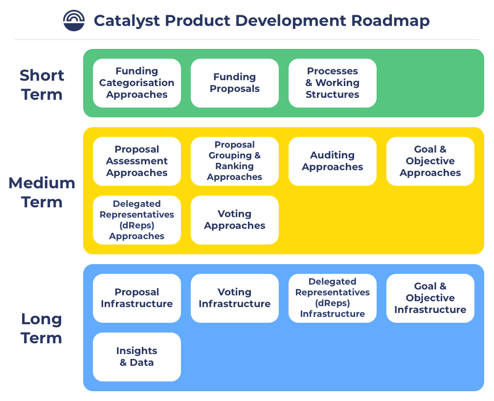

# Product Development Roadmap

_Roadmap version 0.2_

### **Disclaimers**

**Draft version** - This is an initial draft version that aims to just share some initial ideas towards a product development roadmap. It will change and be updated based on community feedback.

**Community led** - There is nothing official about these ideas or roadmap. It is a completely community led initiative and only a suggestion. This approach has a number of objectives as outlined below. Anyone can choose to ignore this roadmap and any of the ideas presented. Alternatively anyone can also participate as much as they want to.

**Work on what you want** - This roadmap does not to prevent anyone from working on anything they want to in whatever order they want to.

**Roadmap items are derived from existing analysis** - Existing analysis on funding categorisation helped to highlight the importance of separating goals and objectives from funding categorisation. This roadmap inherits the results of that analysis.

### **Objectives**

**Increase speed of improving Catalyst -** If a number of community members get behind a group of areas to work on it could help to increase the speed in which the Catalyst ecosystem is improved. The faster that Catalyst can improve the more effectively the ecosystem can scale to handle more proposals and voters and more total funding used in each round.

**Increase alignment -** Discussing different approaches to prioritisation and order of execution helps to bring more alignment in what the community believes are the main priorities. For instance, if many people in the community agree that understanding what makes a good proposal is a high priority in the short term then it will be easier to bring people together to collaborate on doing work in this area to a higher quality.

**Increase collaboration -** Increasing the amount of discussion on focussed areas to improve in the ecosystem helps to bring the community together and collaborate on how to work on those areas most effectively. This can help to reduce duplicated efforts. The better we can discuss these different areas as a community the more likely it is for collaboration between community members who are able to support Catalyst.

### Product Development Roadmap

The roadmap focusses more on suggesting a suitable order of execution for important areas in the Catalyst ecosystem that can be worked on.

A list of areas are grouped below into rough time frames that the community could work on to improve Catalyst. The areas that are most depended on by other areas are placed in the shorter term grouping. The areas that build more on top of other areas are placed into the medium and long term groupings.

The time based groupings are rough suggestions and are not a statement that work should only be done on the areas in the short term grouping. Instead, these suggestions are more concerned with where it may make sense to have a higher intensity of focus and effort over time.

As an example, it is logical to have a higher intensity of focus and effort on understanding what makes a good proposal in the short term. The outcomes of that work would be beneficial for other areas such as proposal assessment approaches or proposal infrastructure.

Effort will be needed for all of these areas in the short term. The key question we’re trying to answer is which areas will be the most effective to spend more time on in the short term over other potential areas? Which areas are more dependent on the quality and outcome of work in other areas of the funding process?

<figure><figcaption>
Catalyst Product Development Roadmap - Version 0.2
</figcaption></figure>

### Short term

**Funding categorisation approaches**

Funding categorisations group together focus areas along with a budget to allow proposers to submit proposals in each funding round. Funding categorisations determine what types of funding models exist and what areas in the ecosystem have access to funding. Funding categorisations directly impact the incentives that exist to support and improve the ecosystem. Looking at approaches to funding categorisation for the Cardano ecosystem means finding out what approaches are scalable and effective at incentivising high quality proposals that will create impact for a global blockchain ecosystem and that can handle adverse situations.

* Existing community work:
  * [Catalyst Funding Categories](http://localhost:5000/o/Pr76HeHUxsbctwx0OULs/s/QQsRsN95MX1ihFh4Vffn/)
  *   [Funding Categorisation Analysis](http://localhost:5000/o/Pr76HeHUxsbctwx0OULs/s/wD0ZpGoCt4aFrCJnqaW0/)

      * [Contributor Categorisation Analysis](http://localhost:5000/o/Pr76HeHUxsbctwx0OULs/s/gdWEUdtxBpngJ9kJPPlB/)
      * [Idea Categorisation Analysis](http://localhost:5000/o/Pr76HeHUxsbctwx0OULs/s/wD0ZpGoCt4aFrCJnqaW0/)

**Proposal standards**

What makes a good proposal needs to be defined and how that information could be included and structured. Proposal standards should outline what information is most beneficial and useful for an idea or contributor based proposal. Structuring proposal information into a standard with what is required and optional provides a way for multiple implementations to be created on top of the defined standard. Analysis can help to effectively define what information is most beneficial to these different types of proposals and also how this information may change over time. These standards will change over time as new technology is adopted or new use cases need to be supported.

**Goal and objective standards**

Goals and objectives allow the community to share what they believe is the highest priority area of focus for the ecosystem which would benefit from more support or funding. Creating standards for goals and objectives will mean looking at what information to include and how to structure this information effectively. The community will need to be able to create infrastructure based off any standards created for the community to set goals and objectives and for that to be integrated into other pieces of infrastructure.

**Processes & Working Structures**

Catalyst will have an increasing number of parameters, standards and infrastructure being used in the funding process by the community. Assessing processes and working structures will define how these are maintained, improved and changed. Exploring different working and governance structures will help in finding effective ways for the community to collaborate together to change and improve the Catalyst funding process.

*   Impacted by:

    * Funding categorisation approaches - Many processes in Catalyst will need recurring support. This means the incentive structures created by funding categorisation will be important to ensure support is available to maintain and improve these systems and processes.

### Medium term

**Proposal assessment approaches**

Approaches for doing proposal assessments helps to highlight the quality, accuracy and intent of the proposals submitted. Objective assessment approaches can explore what information should be included and the quality or accuracy of that information. Subjective assessment approaches can explore how to incorporate peoples opinions and expertise against what has been proposed to highlight things such as the quality, auditability, feasibility and potential impact of a given proposal.

* Dependencies:
  * Proposal standards - To most effectively assess proposals there is a benefit that the information that is most beneficial to understand the proposal is included and clearly structured.

**Proposal grouping and ranking approaches**

As the number of proposals grow there is an increasing importance in creating effective ways to group and rank proposals based on certain data points or attributes. Groupings could be around tags, goals and objectives, proposal types or any other relevant attribute. Proposal ranking algorithms and approaches could be influenced by goals and objectives, team history and relevant historic Catalyst data. Voters need an easy and effective way to vote on proposals in the areas that they know or care about.

* Dependencies:
  * Proposal standards - To group and rank proposals there is a need to have the most useful information included in all proposals submitted so they can be more easily compared and sorted.

**Auditing approaches**

Auditing approaches can focus on either progress or the outcome of funded proposals. Progress auditing approaches will help to determine the actual progress of a funded proposal in executing what it intended to do and how the community could respond to different scenarios. Outcome auditing approaches can help with trying to determine how effectively a given proposal or contributor has managed to achieve the goals and objectives they set out in their proposal and whether that initiative did in fact create much impact.

* Dependencies:
  * Proposal standards - The intent and planned delivery for a proposal should be included and well structured. This information will allow for effective auditing approaches to consume and apply this information in the auditing different approaches.

**Goals and objective infrastructure**

Applications are needed for the community to start expressing what is priority for the ecosystem. This information needs to be publicly available and consumable by other services and applications in the ecosystem. Infrastructure will help the community participate in expressing their opinions and collectively to better direct attention to areas that need it. This information is well suited in the voting infrastructure to highlight which proposals match up with what goals and objectives. Goals and objectives could also be integrated into multiple processes and applications in the funding process.

* Dependencies:
  * Goal and objective standards - Standards can be followed in the implementations

**Distributed representative (dRep) standards**

IOG has started work in this area and is currently handling the introduction of distributed representatives along with the standards in which it will function on-chain. The evolution of this will be done in collaboration with the community and from the experience of the first cohorts who become dReps. Over time either in the medium or long term the core work for this can be pushed over to the community to handle.

**Voting standards**

Voting standards will concern the approaches used to vote on and govern the distribution of funds from the Cardano treasury to selected proposals and initiatives. On chain voting and how that works from a standards perspective is currently being implemented and managed by IOG in their own sidechain and used in the voting app. The community can expect efforts to eventually move over to the community at some point in the medium or long term.

### **Long term**

**Distributed representative (dRep) infrastructure**

dRep infrastructure could soon represent a wide number of applications and options for the community to use to learn about, interact with and delegate to distributed representatives in the community. Once standards are made on how someone can become a dRep on-chain in the ecosystem the community will be able to create infrastructure that makes it easier to interact with this use case and consume any relevant information.

* Dependencies:
  * Distributed representative (dRep) standards - Any standards are used in the implementations

**Voting infrastructure**

Voting infrastructure should handle presenting submitted proposals to the community and allow them to vote on proposals they would like to receive funding. After the voting period finishes the tallying of votes will reveal the winning proposals. Currently there is already a voting app owned and managed by IOG. At some point in the future these efforts will be pushed into the community.

* Dependencies:
  * Proposal standards - Inherit any relevant proposal standards to allow proposals to be added to voting infrastructure
  * Voting standards - Integrate any voting standards agreed within the community such as the standards to accept the current up vote, down vote and abstain options provided in the current voting app. Applying standards allows the community to better achieve pluralism within the community and have multiple different voting based applications.
  * Proposal grouping and ranking approaches - Apply approaches to proposal groupings and rankings to make it easier for voters to view proposals before voting.

**Proposal infrastructure**

Proposal infrastructure should help allow the community to submit proposals and relevant information for the community to consider for funding. Infrastructure may help with areas such as verifying team details, execution history, funding history and just applying the correct structure to the proposal information based on any proposal standards being used in the community.

* Dependencies:
  * Proposal standards - Inherit any relevant proposal standards to ensure proposals submitted follow those standards. Applying standards allows the community to better achieve pluralism within the community and have multiple different proposal based applications.
  * Goal and objective standards - Proposals will benefit from highlighting which goals and objectives they are focussing on and as such could apply any standards created around setting goals and objectives within a proposal.

**Insights and data**

Throughout the funding process there is value in integrating insights and data from areas internal and external to the process so that each phase of the funding process can be enriched with relevant and high quality information. The more relevant and useful the information is that can be made available the better that decision making can be achieved at different phases in the process.

*   Dependencies:

    * Any Catalyst standards - Standards created and used in the Catalyst process that get applied to community made infrastructure will create new feeds of important data. This data can be fed into aggregated insights and data that can be used to enhance different applications or processes.

### Feedback & suggestions

Share any feedback and criticisms in the [PACE telegram chat](https://t.me/cardanopace) on how to improve these groupings or for adding any other areas. This is a draft roadmap to start suggesting ideas and sharing our thoughts.

As this is a starting draft version we expect we’re likely missing work done by the community that has focussed on some of these areas that we haven’t seen. If there is any other existing community work around any of these areas then please add any details in the comments.
