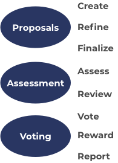

# Catalyst Product

The Catalyst product helps to govern the Cardano treasury. There are a number of core services that are required to take a proposal from its draft stages through to a governance and a rewarding stage. During this process there can also often be secondary services that compliment the overall process but are not strict requirements to use or participate in.

### Core Services

A number of core services exist in Catalyst that make the governance of the treasury possible. Currently that governance process uses a proposal focussed process and includes assessments and a voting stage with the wider community.

1. **Draft proposals** - Proposers submit draft proposals to start receiving feedback from the community.
2. **Refine proposals** - Proposers are able to edit and refine their proposals based upon any feedback received or general improvements they want to make.
3. **Finalize proposals** - Proposers make any final changes to their proposals before they are submitted as a final version.
4. **Assess proposals** - Community members assess the proposals based on their impact, feasibility and auditability attaching a score and any reasoning.
5. **Review proposal assessments** - Veteran proposal assessors review the assessments made to filter out any that don't follow the guidelines and rate the remaining assessments either good or excellent.
6. **Voting** - Cardano community members who have registered their wallets can vote on the proposals they want to see funded. Voters can down vote, abstain or up vote on any proposal.
7. **Tallying votes** - The votes get tallied to find out which proposals have been funded. Currently the totals are calculated from the total ADA held in the registered wallets where each ADA represents a single point of voting power. Any upvote or downvote uses the full amount of the wallets total ADA for the voting decision.
8. **Rewarding** - Proposals with the most upvotes start receiving funding on a monthly basis.&#x20;
9. **Reporting** - Proposers submit progress reports to provide evidence that progress is being made. Reporting is a requirement for proposers to continue to receive funding each month.

<figure><figcaption>
Catalyst product flow
</figcaption></figure>

### Secondary Services

The following services add value to the Catalyst process however are secondary to the user flow. No one is required to use or be involved in these services. Often they may be encouraged and recommended to the community. In future iterations secondary services could become core to the overall product if they became a required service.

* **Insight sharing** - The community is able to offer their insights, data and analysis that will help provide value to the upcoming funding round.
* **Flagging assessments** - Proposers can flag assessments they believe are violating the community guidelines.
* **Town halls** - The Catalyst community come together to learn about news and updates about the Catalyst ecosystem and progress or completion presentations from proposal teams.
* **After town halls & swarm sessions** - The Catalyst community create multiple topic based rooms and open up discussion to anyone in the community interested in sharing ideas, thoughts and concerns.
* **Idea fest** - Proposers are able to showcase their proposal in a presentation and answer questions from the community.
